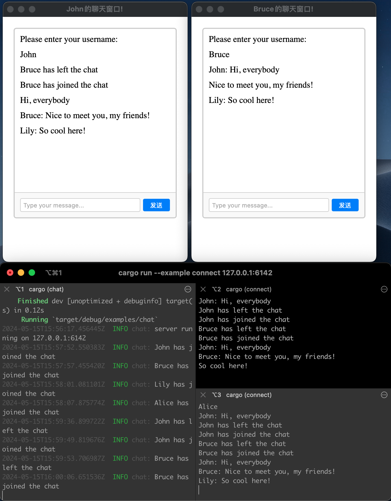

## Desktop Chat Software
- Screenshot
  - 
- TODO
  - STEP1
    - [x] Implement message sending by clicking the send button in a single client window; the current chat window should display messages sent by multiple users. 
    - [x] Open multiple client windows, each automatically named. 
    - [ ] Enable message sending between clients and display the messages in the chat windows.
    - [ ] Optimize the chat display page, with messages from others shown on the left and messages sent by oneself on the right.
  - STEP2
    - Personalize settings for each client and save these settings locally.
    - Log recording.
  - STEP3
    - Add a feature to add friends.
    - Individual chat mode.
    - Group chat mode.
  - STEP4
    - Enable sending emoji images.
    - Enable sending individual files.
    - Enable sending folders.
- DONE
  - Preliminary framework established, capable of properly rendering the client desktop application.

## References
- [example-projects](https://github.com/DioxusLabs/example-projects)